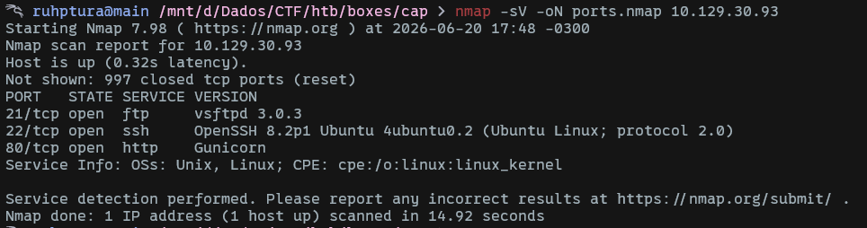
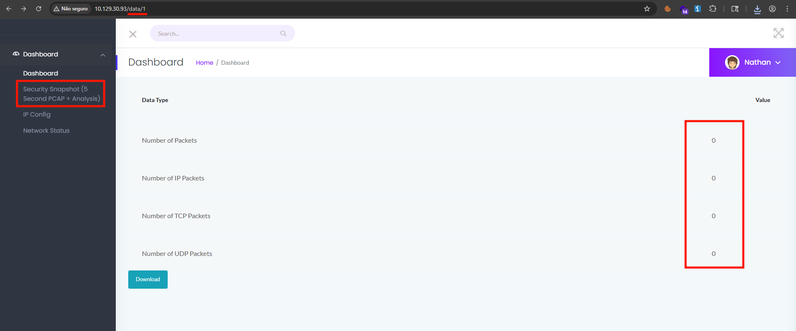
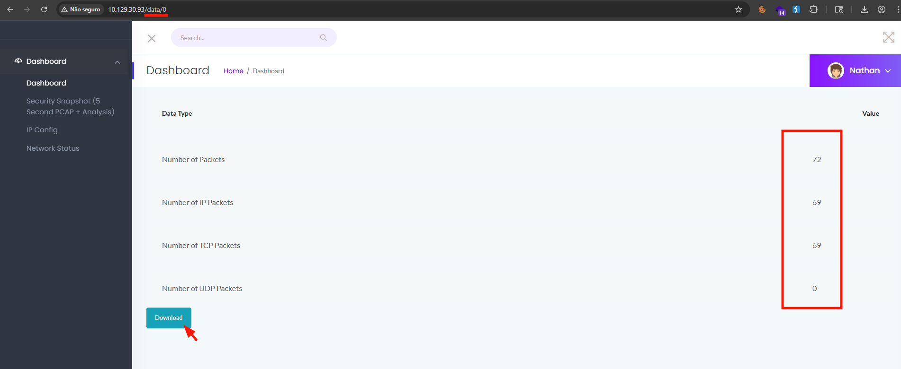
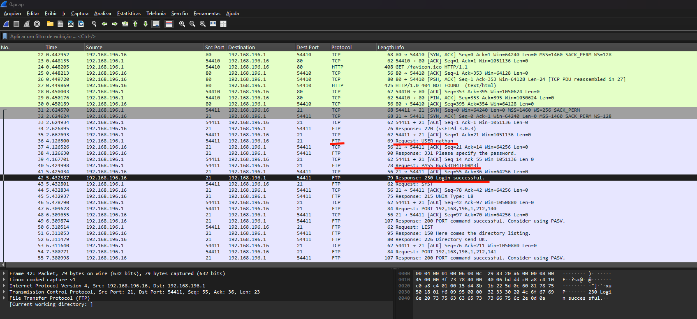
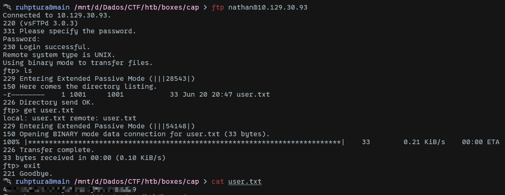
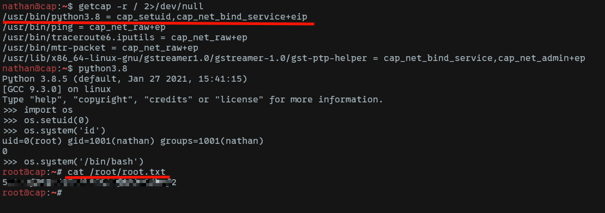

# Cap

Port enumeration reveals an FTP service and a web application.

Checking the website, we notice an IDOR vulnerability on `/data/<id>`. Our current ID, 1, has no useful packets. However, ID 0 contains packets, and we can download the PCAP file:

Analyzing the file in `Wireshark`, we find the FTP credentials:

We confirm the credentials and retrieve the first flag from the FTP server:

The same credentials work for SSH, so we log in using them.

The privilege escalation path, as the box's title suggests, involves capabilities. We can list files with configured capabilities by running `getcap -r / 2>/dev/null`:

Since `python3.8` has the `cap_setuid` capability, we can exploit it to spawn a shell with root privileges and obtain the final flag.