# Orion

This machine primarily focuses on exploiting CVEs. Running an Nmap scan, we find a web application running.

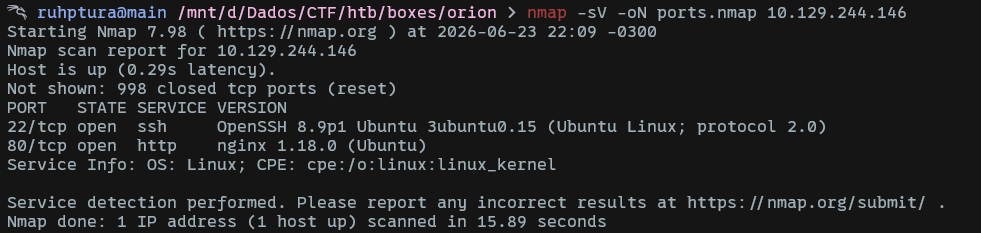

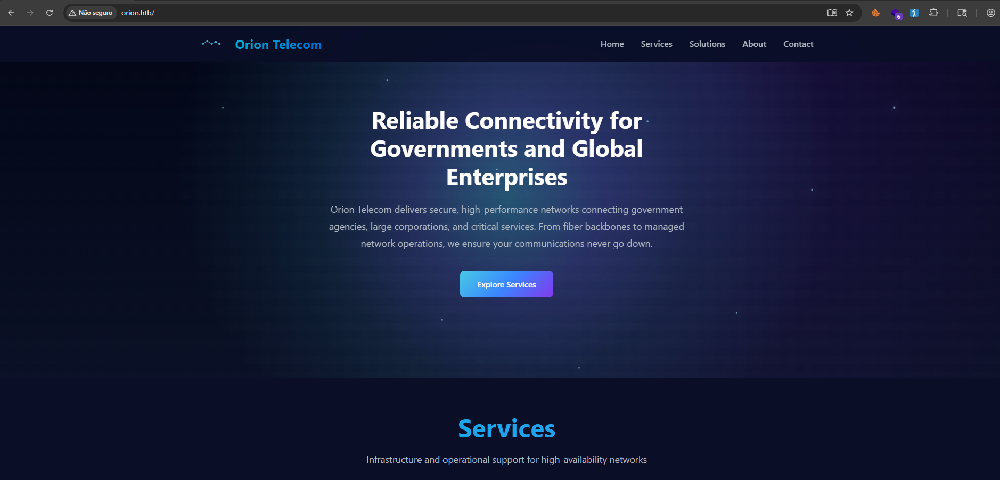

We didn't find any subdomains.

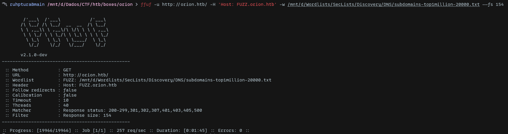

However, there is an admin page.

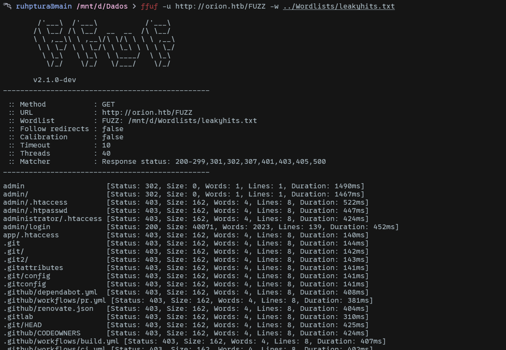


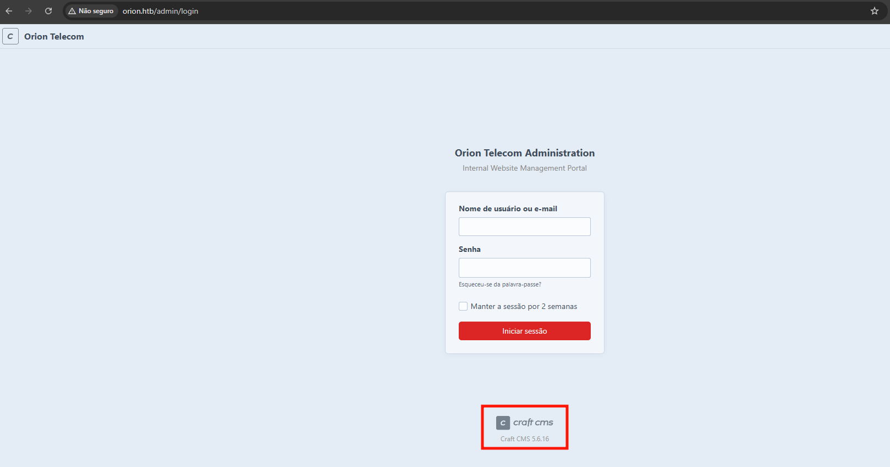

After researching this CMS, we find the following CVE:

https://nvd.nist.gov/vuln/detail/CVE-2025-32432


There is a Metasploit module available for this CVE, which we can use to exploit the vulnerability.

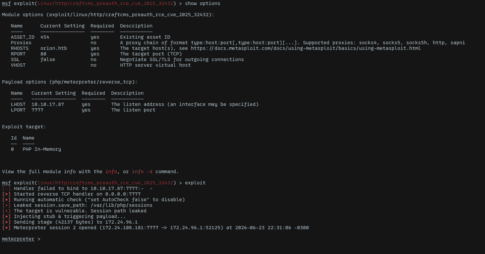

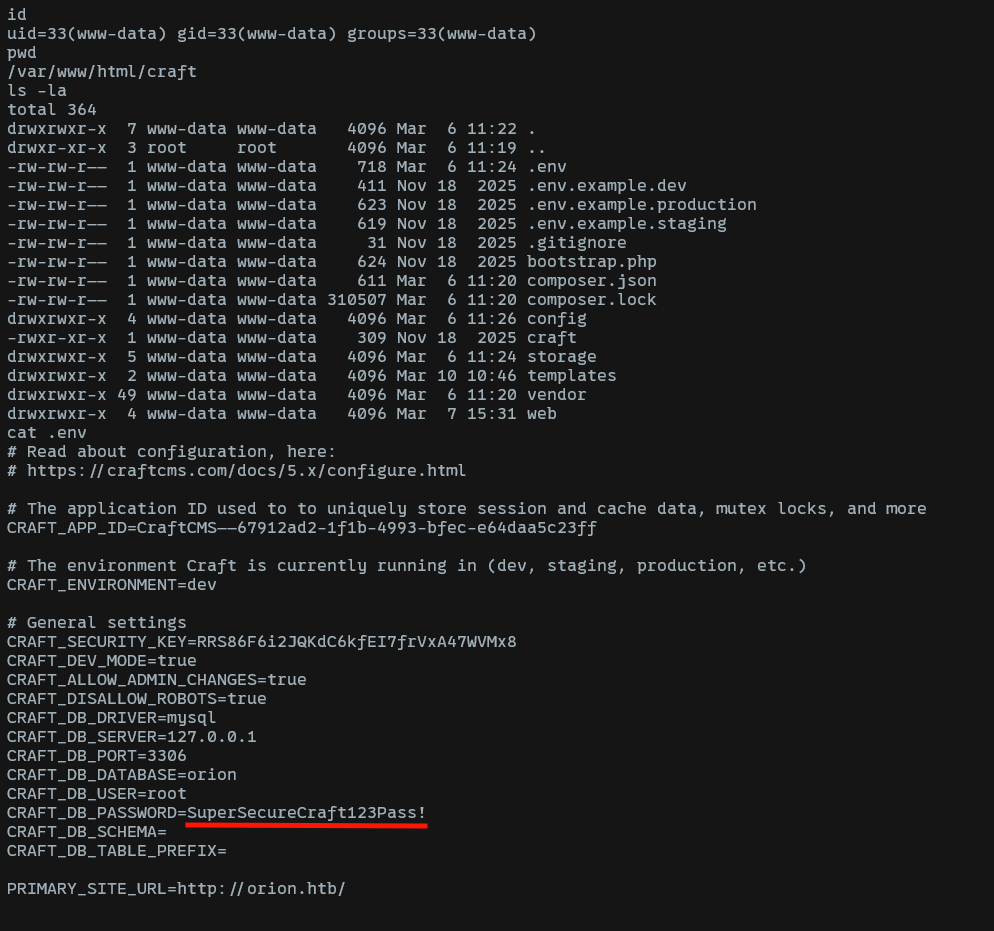

We find the MySQL credentials in the `.env` file. We can connect using the password `SuperSecureCraft123Pass!`:

```bash
mysql -D orion -u root -p
```

```sql
select * from users;
```

After retrieving the `users` table, we get the password hash for adam, who is a user on this machine.

| email | password |
|----------|----------|
| adam@orion.htb | $2y$13$e9zuohgFZzGtbQalcn9Mz.5PJbjxobO0GMbXo8NHp3P/B42LUg0lS |

We can crack this hash using `john`:

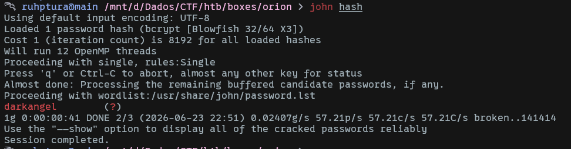

We can log in as `adam:darkangel` via SSH and inspect the local ports in use. Interestingly, there is a telnet service running, which I will tunnel to my host to test more easily.

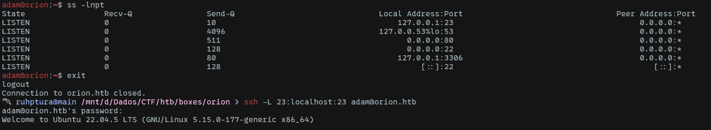

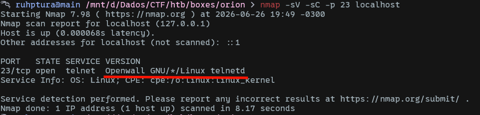

After searching for the service name, we find a related CVE:

https://github.com/SystemVll/CVE-2026-24061

After downloading and executing the script, we become root and obtain the flag.

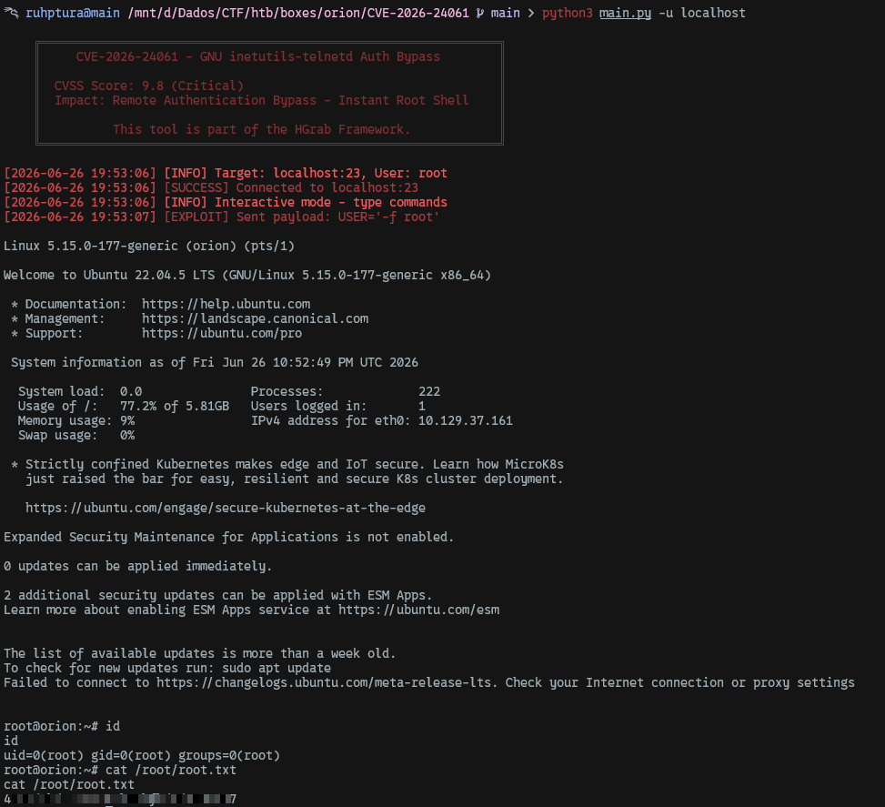